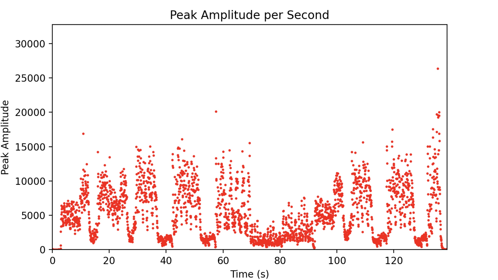
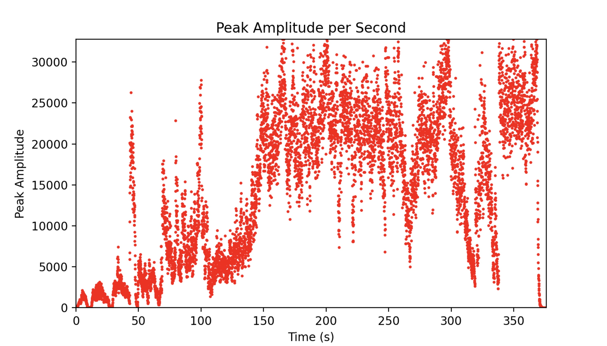
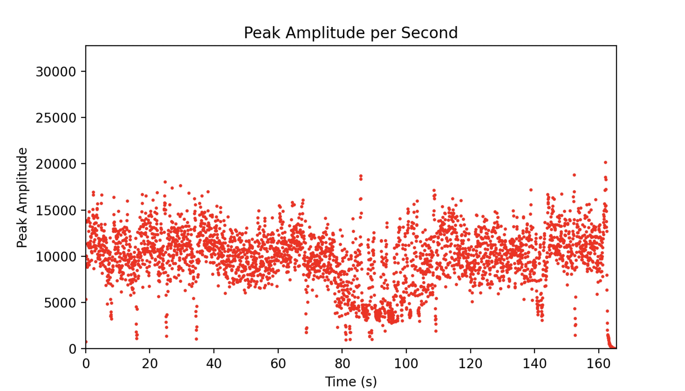

## Overview

The **Mahler Symphony Visualizer** is a Python-based application designed to visualize audio files by analyzing their waveforms and amplitude levels in real-time. This project explores the transformation of raw audio data into meaningful visual representations, providing insights into audio processing and data visualization techniques.

## Features

- **Real-Time Waveform Visualization**: Displays the waveform of the selected audio file as it plays.
- **Amplitude Analysis**: Plots the amplitude of the audio signal over time.
- **User-Friendly Interface**: Built with Tkinter, offering intuitive controls for selecting and playing audio files.
- **Support for Multiple Audio Formats**: Handles `.wav` and `.mp3` audio files.
- **Interactive Controls**: Play, pause, and stop functionalities for seamless audio playback.

## Technologies Used

- **Python 3.8+**
- **Tkinter**: For GUI development.
- **Matplotlib**: For plotting waveforms and amplitude graphs.
- **NumPy**: For numerical computations and data handling.
- **Pyaudio**: For audio playback.
- **Logging**: For error tracking and debugging.

## Some Examples

#### Brahms, 21 Hungarian Dancers

#### Mahler, Symphony No.2

#### Vivaldi, Spring

